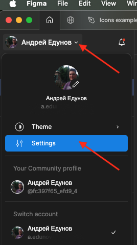
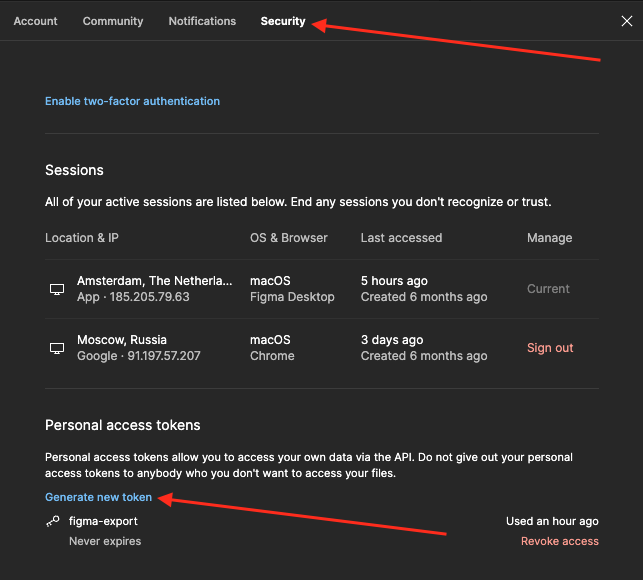
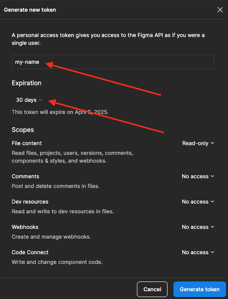
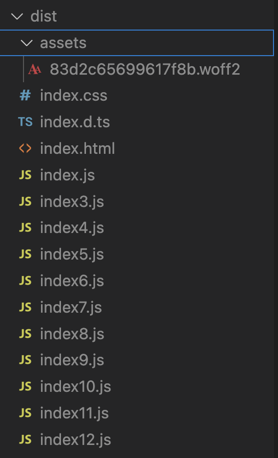
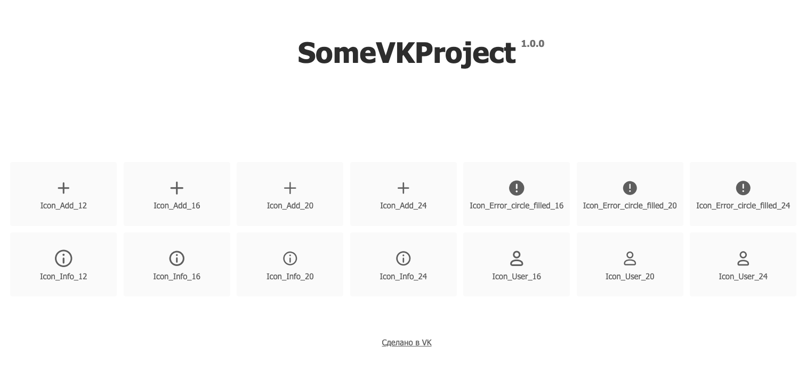

# Скрипт для создания иконочного шрифта из иконок в Figma

Этот инструмент превращает иконки из Figma в иконочный шрифт — быстро и удобно. Вот что важно знать:

- **[TLDR; Как запустить](#tldr-%D0%BA%D0%B0%D0%BA-%D0%B7%D0%B0%D0%BF%D1%83%D1%81%D1%82%D0%B8%D1%82%D1%8C-)** 🚀
- [А зачем мне вообще иконочный шрифт? Плюсы и минусы](#%D0%B0-%D0%B7%D0%B0%D1%87%D0%B5%D0%BC-%D0%BC%D0%BD%D0%B5-%D0%B2%D0%BE%D0%BE%D0%B1%D1%89%D0%B5-%D0%B8%D0%BA%D0%BE%D0%BD%D0%BE%D1%87%D0%BD%D1%8B%D0%B9-%D1%88%D1%80%D0%B8%D1%84%D1%82-%D0%BF%D0%BB%D1%8E%D1%81%D1%8B-%D0%B8-%D0%BC%D0%B8%D0%BD%D1%83%D1%81%D1%8B-)
- [Что я получу на выходе?](#%D1%87%D1%82%D0%BE-%D1%8F-%D0%BF%D0%BE%D0%BB%D1%83%D1%87%D1%83-%D0%BD%D0%B0-%D0%B2%D1%8B%D1%85%D0%BE%D0%B4%D0%B5-)
- [Альтернативные решения](#%D0%B0%D0%BB%D1%8C%D1%82%D0%B5%D1%80%D0%BD%D0%B0%D1%82%D0%B8%D0%B2%D0%BD%D1%8B%D0%B5-%D1%80%D0%B5%D1%88%D0%B5%D0%BD%D0%B8%D1%8F-)
- [Как использовать](#%D0%BA%D0%B0%D0%BA-%D0%B8%D1%81%D0%BF%D0%BE%D0%BB%D1%8C%D0%B7%D0%BE%D0%B2%D0%B0%D1%82%D1%8C)
- [Как скрипт работает по шагам](#%D0%BA%D0%B0%D0%BA-%D1%81%D0%BA%D1%80%D0%B8%D0%BF%D1%82-%D1%80%D0%B0%D0%B1%D0%BE%D1%82%D0%B0%D0%B5%D1%82-%D0%BF%D0%BE-%D1%88%D0%B0%D0%B3%D0%B0%D0%BC-%EF%B8%8F)
- [Как настроить под себя](#%D0%BA%D0%B0%D0%BA-%D0%BD%D0%B0%D1%81%D1%82%D1%80%D0%BE%D0%B8%D1%82%D1%8C-%D0%BF%D0%BE%D0%B4-%D1%81%D0%B5%D0%B1%D1%8F-)
- [Вопросы, баги, помощь](#%D0%B2%D0%BE%D0%BF%D1%80%D0%BE%D1%81%D1%8B-%D0%B1%D0%B0%D0%B3%D0%B8-%D0%BF%D0%BE%D0%BC%D0%BE%D1%89%D1%8C-)

## TLDR; Как запустить 🚀

1. Генерируем [Figma API-токен](https://www.figma.com/developers/api#authentication):  
     
     
   
2. Задаём токен, выполняя команду в терминале: `export FIGMA_TOKEN=YOUR_TOKEN_HERE`  
   _Можно использовать `.env` или настроить это в CI._
3. Запускаем сборку: `npm run build` 🛠️  
   _Результат — в папке `dist`._
4. Проверяем: `npm run start` → http://localhost:3000

## Демо Figma

Демо-файл с правилами именования иконок и размерами:

- https://www.figma.com/design/aSLjeN0RVh6BGKjvlsX53M/Icons-example-for-iconFont-generator-for?node-id=4-143&t=JWqPmdrrPJslVRKV-1

## А зачем мне вообще иконочный шрифт? Плюсы и минусы 🤔

Иконочный шрифт — это удобный способ работы с иконками. Но у него есть свои сильные и слабые стороны.

### Преимущества

✅ **Гибкость стилизации** 🎨

- Легко менять _размер_, _цвет_, _тень_ через CSS — никаких растровых изображений.
- Векторная графика: масштабируется без потери качества.

✅ **Лёгкость в использовании**

- Подключается как шрифт через `@font-face` или CDN.
- Иконки вставляются просто: `<i class="icon-name"></i>` или через `::before`/`::after`.

✅ **Производительность** ⚡

- Один файл для сотен иконок — меньше HTTP-запросов.
- Рендеринг быстрее, чем у SVG/PNG, особенно с кэшем.

✅ **Совместимость**

- WOFF2 работает [во всех современных браузерах](https://caniuse.com/woff2) (кроме Opera Mini и IE11).
- Не требует JavaScript.

✅ **Доступность**

- Поддержка `aria-hidden="true"` и CSS `content` для экранных читалок.

✅ **Маленький размер**

- Пример: 360+ иконок — всего 63 КБ в WOFF2.

### Недостатки

❌ **Ограничения дизайна**

- Только монохромные иконки — без градиентов и сложных эффектов.
- Масштабирование может "плыть" в некоторых браузерах.

❌ **Проблемы с доступностью**

- Без `aria-label` или `title` иконки недоступны для скринридеров.
- Псевдоэлементы иногда "прячут" иконки от assistive-технологий.

❌ **Лишний вес**

- Загружается весь шрифт, даже если нужна всего одна иконка.

❌ **Зависимость от рендеринга**

- Качество зависит от сглаживания шрифтов (особенно на Windows).

### Когда использовать?

- **Да:** для простых иконок с кастомизацией через CSS и упором на скорость.
- **Нет:** если нужны многоцветные, анимированные или полностью доступные иконки.

## Что я получу на выходе? 🎁

- Готовый пакет с артефактами в `dist` для использования в проектах.
- Шрифт в WOFF2, CSS, TypeScript-типы и React-компоненты с a11y.
- Лёгкая кастомизация под ваши задачи.

  


## Альтернативные решения 🔍

Есть плагины для Figma: [svg2webfonts](https://www.figma.com/community/plugin/1475955978783123863/svg2webfonts-exporter) и [svg2fontify](https://www.figma.com/community/plugin/1371056425685311528/svg2fontify). Но у них:

- Нет демо-страницы.
- Нет NPM-пакета.
- Обводки не преобразуются в заливку — иконки искажаются при масштабе.
- Мало настроек.
- Нет поддержки разных размеров.

Наш скрипт закрывает эти пробелы. 🌟

## Как использовать

### 1. Как шрифт

1. Подключаем стили: `@demo/icons/dist/style.css`
2. Используем классы (они типизированы в `src/generatedTypes.ts`): `<i className="SomeVKProject-Icon_Add_12" />`
3. Стилизуем: `<i className="SomeVKProject-Icon_Add_12" style="color: red;" />`  
    _Или через родителя: `<span style="color: red;"><i className="SomeVKProject-Icon_Add_12" /></span>`_  
   _Совет:_ для a11y лучше взять React-компоненты (см. ниже).

### 2. Как React-компоненты ⚛️

1. Подключаем стили: `@demo/icons/dist/style.css`.
2. Импортируем: `import {IconAdd12} from '@demo/icons';`
3. Используем: `<IconAdd12 />`  
   _Доступность (a11y) обеспечена, так как мы заботимся о скринридерах в этом варианте._

## Как скрипт работает по шагам ⚙️

Скрипт запускается командой: `"build": "npm run clear && npm run check429 && npm run icons:import && npm run icons:generate && vite build && npm run clear:tmp"`

1. **`npm run clear`**  
   Очищает `dist` и `tmp`.
2. **`npm run check429`**  
   Делает предварительную проверку Figma API и выводит понятную ошибку при `429 rate limit`.
3. **`npm run icons:import`**  
   Скачивает SVG из Figma через [@figma-export/output-components-as-svg](https://www.npmjs.com/package/@figma-export/output-components-as-svg).  
   Настройки — в `.figmaexportrc.js`. Результат — в `tmp/svgImported`.
4. **`src/system/generate.mts`**
   - `clear()` — очищает `tmp` от старых данных.
   - `checkIconNames()` — проверяет названия (латинские буквы, цифры, точка, дефис).
   - `createTmpFolder()` — создаёт `tmp`.
   - `fixSVGFill()` — преобразует обводки в заливку с [oslllo-svg-fixer](https://github.com/oslllo/svg-fixer). Результат — в `tmp/svgFixed`.
   - `addPrefixToIcons()` — добавляет префикс (например, `SomeVKProject`).
   - `generateFonts()` — создаёт шрифт, CSS, типы и HTML через [svgtofont](https://github.com/jaywcjlove/svgtofont):
     - `src/system/templates/style.css` — основной CSS.
     - `src/system/templates/website.njk` — демо-страница.
     - `src/system/templates/generatedReactIcons.tsx.template` — React-компоненты с tree-shaking.
   - `copyDTS()` — копирует `.d.ts` в `src/generatedTypes.ts`.
   - `createIconComponents()` — обогащает React-компоненты и сохраняет в `src/generatedReactIcons.tsx`.
5. **`vite build`**  
   Собирает пакет в `dist`.
6. **`npm run clear:tmp`** 🧹  
   Удаляет `tmp`. _Совет: удалите эту команду, чтобы подебажить процесс._

## CI и хранение артефактов

В этом проекте итоговый `dist` хранится в git. Это нужно, чтобы потребители пакета могли работать без доступа раннеров к внешнему интернету и без сборки иконок на каждом окружении.

## Как настроить под себя 🎨

- **`.figmaexportrc.js`**  
  Укажите `fileId`, `onlyFromPages` и путь для SVG (`tmp/svgImported`).
- **`generateFonts()`**  
  Настройте демо-страницу (брендинг, название).
- **`src/system/templates/website.njk`**  
  Шаблон демо-страницы — меняйте цвета, размеры. _Осторожно, легко сломать!_
- **`src/system/templates/generatedReactIcons.tsx.template`**  
  Измените React-компоненты, сохраняя a11y (используйте `srOnly` из `styles.module.css`).
- **`src/system/templates/style.css`**  
  Добавьте свои стили, например:

  ```
  [class^="{{prefix}}-"][class*="_12"] {font-size: 12px;}
  [class^="{{prefix}}-"][class*="_16"] {font-size: 16px;}
  [class^="{{prefix}}-"][class*="_20"] {font-size: 20px;}
  [class^="{{prefix}}-"][class*="_24"] {font-size: 24px;}
  ```

  В чем их суть и одновременно, рекомендация, у нас договоренность, что иконки могут быть четырех размеров (12 / 16 / 20 / 24), потому что разная толщина вручную лучше чем автоматическое масштабирование. И тут у дизайнеров должен быть контроль, чтобы они называли иконки по шаблону `{Название}_{размер}` (примеры: User_16, Work_24, Shopping_cart_20, Favorite_filled_24). Полностью все правила описаны в [демо-фигме](https://www.figma.com/design/aSLjeN0RVh6BGKjvlsX53M/Icons-example-for-iconFont-generator-for?node-id=4-143&t=JWqPmdrrPJslVRKV-1). Благодаря этому мы и можем в CSS опираться на конкретные размеры и управлять их визуалом! 📖

  Однако, вы вполне можете обойтись только одним размером иконок.

## Вопросы, баги, помощь ❓

Пишите в https://t.me/optyRu
